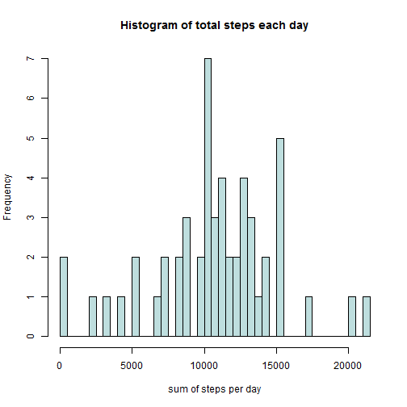
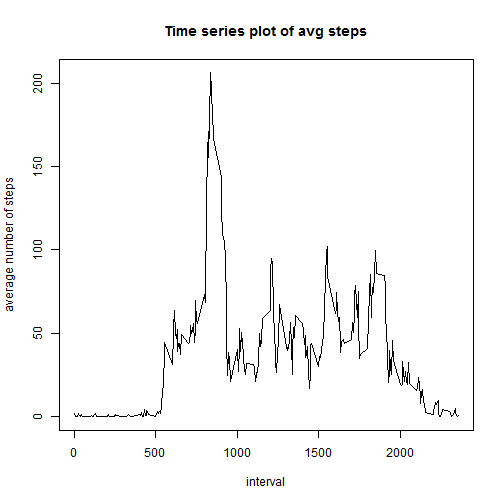
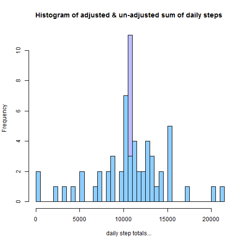
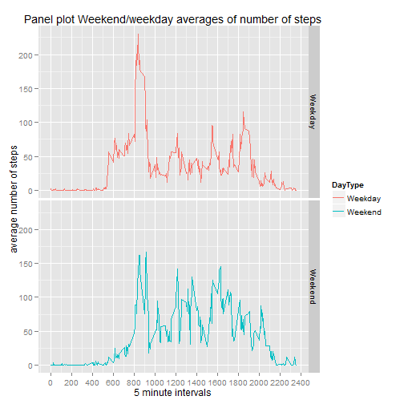

================================================================================================
This assigment involves study of data from a personal activity monitoring device. This device collects data at 5 minute intervals through out the day. The data consists of two months of data from an anonymous individual collected during the months of October and November, 2012 and include the number of steps taken in 5 minute intervals each day.

Questions provided in the assignment are answered in this document using R and knitr

================================================================================================
**About the data**  

The data for this assignment was downloaded from the course web site:  
[Activity Monitoring Data] (https://d396qusza40orc.cloudfront.net/repdata%2Fdata%2Factivity.zip)

The variables included in this dataset are:  

**steps:** Number of steps taking in a 5-minute interval (missing values are coded as NA)  
**date:** The date on which the measurement was taken in YYYY-MM-DD format  
**interval:** Identifier for the 5-minute interval in which measurement was taken  

The dataset is stored in a comma-separated-value (CSV) file and there are a total of 17,568 observations in this dataset.  

================================================================================================

**Loading and preprocessing the data**

Load the data (i.e. read.csv())
Process/transform the data into a format suitable for analysis.  


```r
data <- read.csv("activity.csv", header=TRUE)
library(plyr)
data_sum <- ddply(data, c("date"), summarize, sum(steps))
colnames(data_sum)[2] <- "steps_per_day"
```

**What is mean total number of steps taken per day?**  
For this part of the assignment, the missing values in the dataset are ignored.
A histogram of the total number of steps taken each day is studied.


```r
summary(data_sum)
```

```
##          date    steps_per_day  
##  2012-10-01: 1   Min.   :   41  
##  2012-10-02: 1   1st Qu.: 8841  
##  2012-10-03: 1   Median :10765  
##  2012-10-04: 1   Mean   :10766  
##  2012-10-05: 1   3rd Qu.:13294  
##  2012-10-06: 1   Max.   :21194  
##  (Other)   :55   NA's   :8
```

```r
hist(data_sum$steps_per_day, breaks = nrow(data_sum), 
     xlab= "sum of steps per day", 
     main="Histogram of total steps each day", col = rgb(0,0.5,0.5,0.25))
```

 

```r
m1 <- mean(data_sum$steps_per_day, na.rm=TRUE)
m2 <- median (data_sum$steps_per_day, na.rm=TRUE)
```


**Calculate and report the mean and median total number of steps taken per day.  **  
The mean number of steps per day = 1.0766 &times; 10<sup>4</sup>.  
The median number of steps per day = 10765  


**What is the average daily activity pattern?**

```r
data_by_interval <- ddply(data,c("interval"), summarize, mean(steps, na.rm=TRUE))
colnames(data_by_interval)[2] <- "mean_5min"
```
A time series plot (i.e. type = "l") of the 5-minute interval (x-axis) and the average number of steps taken, averaged across all days (y-axis)  


```r
with (data_by_interval, plot(interval, mean_5min, type='l', 
                             ylab = "average number of steps", 
                             main="Time series plot of avg steps"))
```

 

**Which 5-minute interval, on average across all the days in the dataset, contains the maximum number of steps?**    

```r
max_steps <- max(data_by_interval$mean_5min)
row_max_steps <- which (data_by_interval$mean_5min == max_steps)
d1 <- data_by_interval[row_max_steps,]
```

The 5 minute interval **835** , on average across all days in the dataset, contains the maximum number of steps **206.1698**.    
  
  
**Imputing missing values**  

Note that there are a number of days/intervals where there are missing values (coded as NA). 
The presence of missing days may introduce bias into some calculations or summaries of the data.  

1. Calculate and report the total number of missing values in the dataset (i.e. the total number of rows with NAs)   


```r
t1 <- is.na(data$steps)
num_NAs  <- nrow(data[t1,])
```
There are **2304** missing values in the dataset.  


2. Since activity would typically depend upon the time of day, a suitable strategy for imputing missing values would be to **replace missing values** with the **mean for the 5 minute interval**.  

3. Create a new dataset that is equal to the original dataset but with the missing data filled in.  
For further analysis, we will use the new data set with imputed missing values.


```r
data1<- data 
data1$adjusted_steps <- tapply (data1$steps, data1$interval, mean, na.rm=TRUE)
isNotna <- which(is.na(data1$steps) == FALSE)
data1[isNotna, "adjusted_steps"] <- data1[isNotna, "steps"]

#verify using is.na
count(is.na(data1$adjusted_steps))
```

```
##       x  freq
## 1 FALSE 17568
```

4. Make a histogram of the total number of steps taken each day and Calculate and report the mean and median total number of steps taken per day. Do these values differ from the estimates from the first part of the assignment? What is the impact of imputing missing data on the estimates of the total daily number of steps?    
  

```r
data_sum_adjusted <- ddply(data1, c("date"), summarize, sum(adjusted_steps), sum(steps))
colnames(data_sum_adjusted) <- c("date", "adjusted_sum", "sum")

p1 <- hist(data_sum_adjusted$adjusted_sum, breaks = 50, 
           main="Histogram of adjusted & un-adjusted sum of daily steps", 
           xlab= "daily step totals...")
```

```r
p2 <- hist(data_sum_adjusted$sum, breaks = 50)
```

Here we will overlay the histogram of imputed data along with the histogram of raw data, to gauge any apparent differences.


```r
plot(p1, col = rgb(0,0,1,0.25), xlim= c(0, max(data_sum_adjusted$adjusted_sum)), 
     main="Histogram of adjusted & un-adjusted sum of daily steps", 
     xlab= "daily step totals...")
plot(p2, col = rgb(0,1,1,0.25), 
     xlim= c(0, max(data_sum_adjusted$adjusted_sum)), add=T)
```

 

```r
m1_new <- mean(data_sum_adjusted$adjusted_sum, na.rm=TRUE)
m2_new <- median (data_sum_adjusted$adjusted_sum, na.rm=TRUE)
```
The mean number of steps per day based on imputed data is **1.0766 &times; 10<sup>4</sup>**, as compared to **1.0766 &times; 10<sup>4</sup>**, there is no difference between the mean.    
The median number of steps per day based on imputed data is **1.0766 &times; 10<sup>4</sup>**, as compared to **10765**, there is again no significant difference between the medians. 
  
There is really no impact of imputing missing data on the daily total of number of steps.

**Are there differences in activity patterns between weekdays and weekends?**  

The dataset with the filled-in missing values for this part.  
Using the weekdays function, the day of week for each record is computed.  
A new factor variable is created in the dataset with two levels - **"weekday"** and **"weekend"** indicating whether a given date is a weekday or weekend day.  


```r
data1$dayofweek <- weekdays(as.Date(data1$date))
isWeekend <- which(data1$dayofweek %in% c("Saturday", "Sunday"))
data1$DayType <- "Weekday"
data1[isWeekend, "DayType"] <- "Weekend"
data1$DayType <- as.factor(data1$DayType)
```


A panel plot containing a time series plot (i.e. type = "l") of the 5-minute interval (x-axis) and the average number of steps taken, averaged across all weekday days or weekend days (y-axis). 
  

```r
library(ggplot2)
g <- ggplot(data1, aes(x= interval, y = adjusted_steps))
g <- g + facet_grid(DayType ~. )
g <- g + geom_line(stat = "summary", fun.y = "mean", aes(col = DayType) )
g <- g + xlab("5 minute intervals") + ylab("average number of steps") 
g <- g + ggtitle("Panel plot Weekend/weekday averages of number of steps")
g <- g + scale_x_continuous(breaks = seq(from = 0, to = 2400, by = 200))
print(g)
```

 

Based on the time series plots above, the activity start and end times are pretty much the same for weekdays and weekends, but the peak activity, centered around 0800 - 0900 interval,is more on weekdays.   
The variance in mean weekday activity is more as compared to mean weekend activity, across all intervals.
